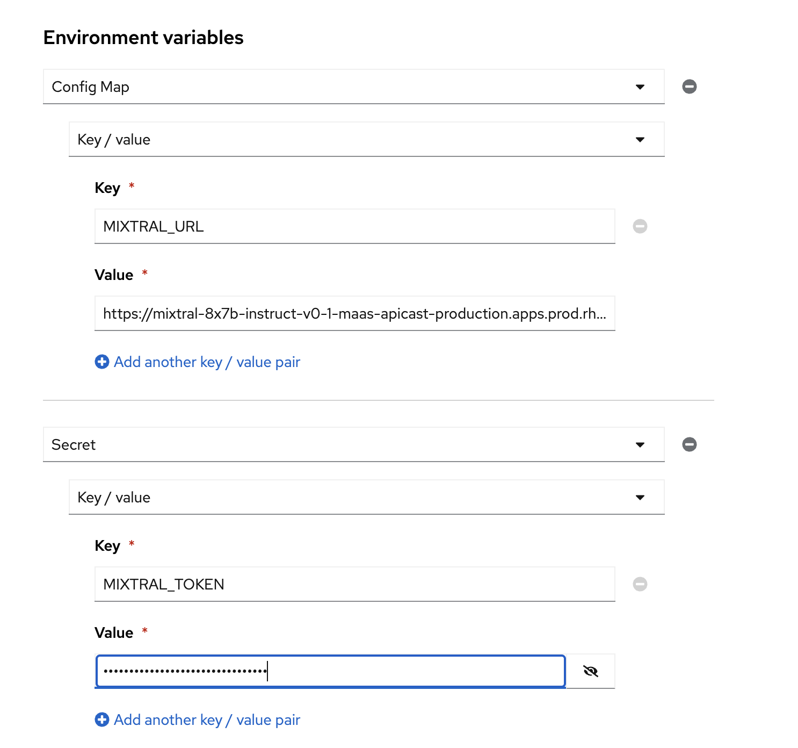

# Jupyter notebook for running SDG

## Pre-requisites

* Setup a MaaS application using [Mixtral-8x7B-Instruct-v0.1](https://maas.apps.prod.rhoai.rh-aiservices-bu.com/admin/applications/new?service_id=mixtral-8x7b-instruct-v0-1), you will need to use this endpoint url and API Key
* Download the RHELAI 1.4.1 skills.jsonl file from https://drive.google.com/file/d/1q8Rxcat5dZxXP-LqgPSCUsyttyAn6aLJ/view?usp=sharing

## Accessing the shared RHOAI BU Cluster

* Connect to the Shared RHOAI BU cluster: https://red.ht/rhoai-bu-cluster
* Log in with the `RedHat-Google-Auth` authentication
* If you don't yet have a project, go ahead and create one.

## Creating the workbench

Create a workbench using the `sdg-notebook` image with a container size of `medium`, accelerator: `None`

Create two environment variables using the endpoint url and API key from the Mixtral-8x7B-Instruct application.

The first environment variable should be a Config Map -> Key / Value
* value: MIXTRAL_URL
* key: Endpoint url  <b>(You need to add /v1 to the end of the URL)</b>

The second environment variable should be a Secret -> Key / Value
* value: MIXTRAL_TOKEN
* key: API key

## Upload the RHEL AI 1.4.1.zip file

From the JupyterLab file explorer, navigate to the `sdg-notebook` folder and click on the "Upload Files" icon.

Select the file `1.4.1.zip` from your local machine.

Once this has uploaded, from the JupyterLab terminal, run

`cd /opt/app-root/src/sdg-notebook`

`unzip 1.4.1.zip`

## Run through the notebook

Open the notebook: `sdg-notebook\sdg_demo_md.ipynb` 

Follow the instructions in the notebook.

Once you are complete, you should have a file `sdg_demo_output\phase10_train.jsonl` which is the generated training data for InstructLab alignment

